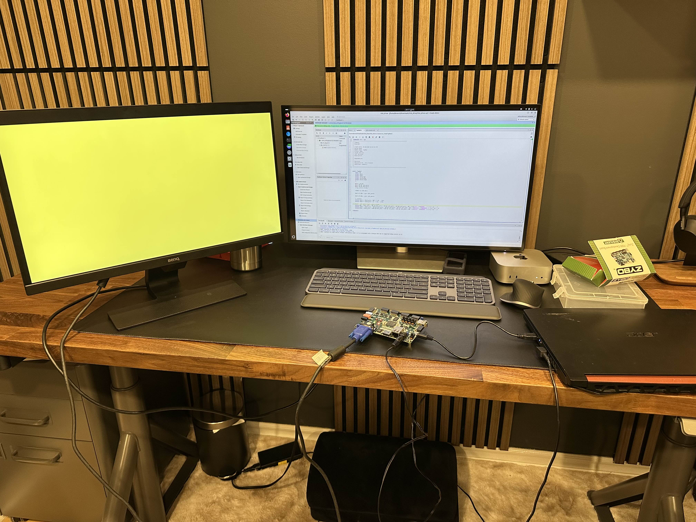
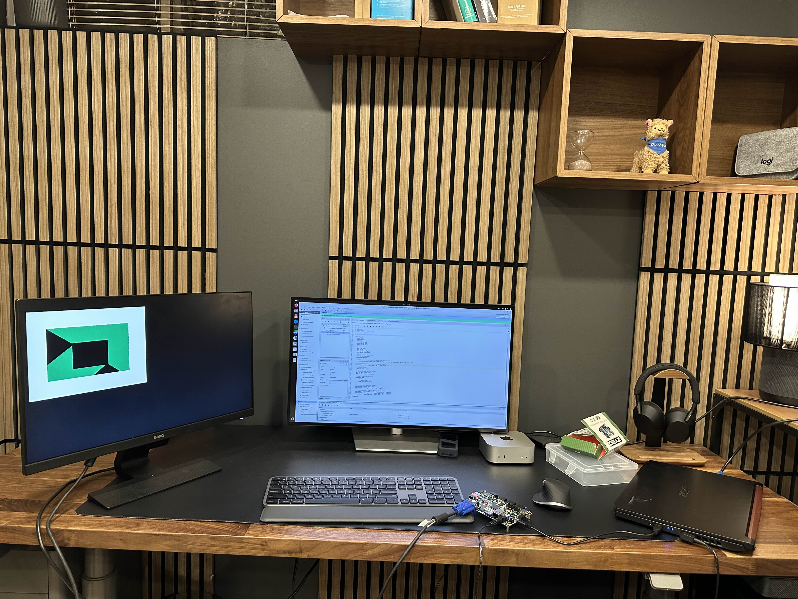

# FPGA VGA Controller to Display Graphics - Zybo Zynq 7000

## Overview

This project involves the implementation of a VGA controller on the Zybo Zynq 7000 FPGA to display graphics on a VGA monitor. The design was based on research into how VGA works, with a primary reference to Digilent’s documentation on implementing a VGA display controller on an FPGA.

## Tools Used

- **FPGA Board**: ZYBO Zynq 7000
- **Software**: AMD Vivado 2024
- **Language**: Verilog
- **Python Script**: `convert.py` (for converting PNG images to .mem files)

## Design Process

### 1. Understanding VGA

The project started with research into how VGA works, focusing on generating a 640x480 display at 60 Hz. This required careful calculation of the total pixels for horizontal and vertical video. The VGA protocol has specific requirements for horizontal and vertical front and back porches. These porches allow the monitor to know when to start the addressable video range.

- **Horizontal Range**: 799 total pixels, with 640 addressable pixels between 144 to 784.
- **Vertical Range**: 524 total pixels, with 480 addressable pixels between 35 to 515.

The design included:
- **Clock Divider**: To manage the clock frequency.
- **Counters**: A horizontal and vertical counter to track the active video range.
- **Video Logic**: The top module contained the logic to calculate when the pixels should be active.

### 2. Initial Testing

Before displaying custom graphics, the first step was to display a solid color by setting the green, blue, and red pins to high. This confirmed the basic functionality of the VGA output.

### 3. Debugging Issues

During the testbench validation, there were a few issues:
- The addressable video range was incorrect.
- The vertical counter did not increment after the horizontal counter reached the front porch.

These issues were resolved by adjusting the logic, but a major roadblock occurred when trying to display the image on a VGA monitor. The monitor displayed an "Out of Range" error, which turned out to be due to the refresh rate. The Zybo FPGA’s internal clock did not divide the clock adequately using the basic clock divider. After researching fractional clock dividers, the issue was resolved, and the video was displayed correctly at 60 Hz.

### 4. Displaying Custom Graphics

After successfully displaying a solid color, the next step was to display custom graphics. However, since Vivado cannot directly handle PNG files, a Python script (`convert.py`) was used to convert the PNG image into a `.mem` file. This file broke down each pixel’s color into a specific hex address.

A memory module was created on the FPGA to store the color codes. These codes were then mapped to the addressable video range for both horizontal and vertical positions. The custom graphic was displayed correctly on the VGA monitor after resolving some issues related to image distortion and clipping from the video range.

### 5. Final Outcome

The project was a success, and custom graphics were displayed on the monitor. The final image, once processed, was shown as expected. 

Display of the Single Colour

Display of the AMD Logo Graphic

### 6. Lessons Learned

This project provided valuable insight into how VGA works at the hardware level. It taught me about the intricate details of VGA timing, video ranges, and how to interface an FPGA with a display. I also gained experience in using fractional clock dividers and memory management on the FPGA. This knowledge will be useful in future FPGA-based projects, especially in areas involving video displays.

## Conclusion

The FPGA VGA Controller project was an exciting and rewarding learning experience, enabling me to dive deep into graphics implementation from the ground up. I look forward to applying this knowledge in future embedded systems projects.
